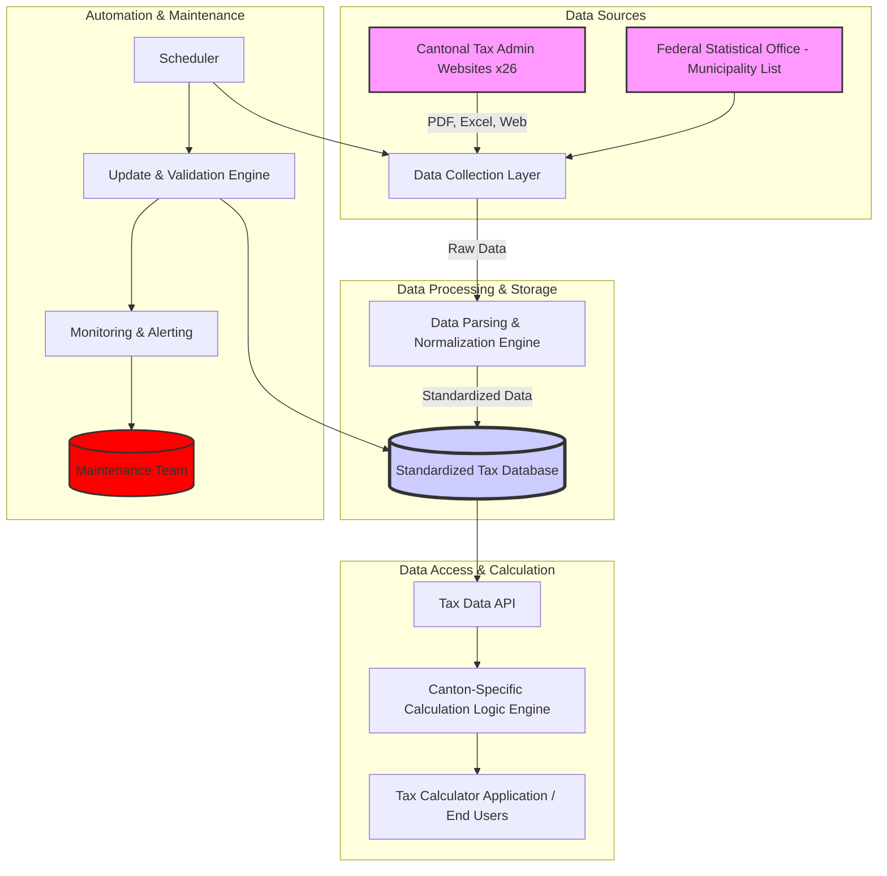

# Swiss Tax Data Platform: Architecture & Implementation Strategy

_Version 1.0 - June 2025_

## 1. Introduction & Vision

This document outlines the architecture for a comprehensive Swiss Tax Data Platform. The vision is to create a centralized, accurate, and up-to-date repository of all Swiss municipal tax data (approx. 2,551 municipalities across 26 cantons), including tax rates/multipliers, and to provide a robust system for accessing and utilizing this data for tax calculation purposes.

This platform aims to solve the current challenge of decentralized, variably formatted, and annually changing tax information published by individual cantonal and municipal authorities.

**Key Goals:**
*   **Completeness:** Cover all ~2,551 Swiss municipalities.
*   **Accuracy:** Ensure data reflects official cantonal and federal tax laws.
*   **Timeliness:** Implement systems for annual (or more frequent) updates.
*   **Standardization:** Provide a unified data model despite diverse source formats.
*   **Accessibility:** Offer a clear API for consumption by tax calculation engines.
*   **Maintainability:** Design for long-term operational sustainability.

## 2. System Architecture Overview

The platform will consist of several key components:

**Components:**

1.  **Data Sources:**
    *   **Cantonal Tax Administration Websites (26):** Primary source for municipal tax rates/multipliers, church tax rates, and specific cantonal deductions.
    *   **Federal Statistical Office (FSO/BFS):** Official list of municipalities (names, BFS numbers, canton affiliation, postal codes).
    *   **Federal Tax Administration (ESTV/AFC):** Federal tax brackets, general deductions (Pillar 3a, etc.).
2.  **Data Collection Layer:**
    *   Automated scrapers and parsers tailored for each cantonal data source.
    *   Manual data entry interface for sources not amenable to automation.
3.  **Data Parsing & Normalization Engine:**
    *   Transforms diverse data formats (PDF, Excel, HTML tables, CSV) into a standardized schema.
    *   Handles language differences and data cleaning.
4.  **Standardized Tax Database:**
    *   Relational or NoSQL database storing normalized tax data.
    *   Schema designed for multi-year data and versioning.
5.  **Tax Data API:**
    *   RESTful API providing access to tax data (e.g., get municipality tax rate for a given year).
6.  **Canton-Specific Calculation Logic Engine:**
    *   Module containing distinct calculation algorithms for each of the 26 cantonal tax systems.
    *   Consumes data from the Tax Data API.
7.  **Update & Validation Engine:**
    *   Automated scripts to check for updates from sources.
    *   Validation rules to ensure data integrity and consistency.
    *   Change detection and versioning.
8.  **Scheduler:**
    *   Manages the execution of collection and update tasks.
9.  **Monitoring & Alerting:**
    *   Tracks system health, data freshness, and collection errors.
    *   Alerts the maintenance team of issues.
10. **Maintenance Team:**
    *   Human oversight for data validation, scraper maintenance, and handling exceptions.

## 3. Data Structures (Standardized Schema)

A standardized data model is crucial. The database will primarily consist of the following entities:

### 3.1. `Cantons`
*   `canton_id` (PK, e.g., "ZH")
*   `canton_name_de` (String)
*   `canton_name_fr` (String)
*   `canton_name_it` (String)
*   `canton_name_en` (String)
*   `official_website_tax_info` (URL)
*   `tax_system_type` (Enum: e.g., "MultiplierOfCantonalBase", "DirectMunicipalRate", "UnifiedCantonalTax")
*   `last_checked_for_update` (Timestamp)

### 3.2. `Municipalities`
*   `municipality_bfs_nr` (PK, Integer - Official BFS Number)
*   `canton_id` (FK to Cantons)
*   `municipality_name` (String - Official Name)
*   `postal_code` (String)
*   `active_status` (Boolean, e.g., for mergers)
*   `last_updated_bfs` (Timestamp)

### 3.3. `MunicipalTaxRates`
*   `rate_id` (PK, AutoIncrement)
*   `municipality_bfs_nr` (FK to Municipalities)
*   `tax_year` (Integer, e.g., 2024)
*   `income_tax_multiplier` (Decimal, nullable - for cantons using this system)
*   `income_tax_rate_direct` (Decimal, nullable - for cantons with direct municipal rates)
*   `wealth_tax_multiplier` (Decimal, nullable)
*   `wealth_tax_rate_direct` (Decimal, nullable)
*   `church_tax_rate_protestant` (Decimal, nullable)
*   `church_tax_rate_catholic` (Decimal, nullable)
*   `church_tax_rate_christian_catholic` (Decimal, nullable)
*   `source_url` (URL of the specific rate document)
*   `valid_from` (Date)
*   `valid_to` (Date, nullable)
*   `data_retrieved_at` (Timestamp)
*   `notes` (Text, for canton-specific details or rate structure)

### 3.4. `FederalTaxBrackets`
*   `bracket_id` (PK, AutoIncrement)
*   `tax_year` (Integer)
*   `marital_status` (Enum: "single", "married_joint")
*   `income_limit_upper` (Decimal)
*   `tax_rate_percentage` (Decimal)
*   `base_tax_amount` (Decimal)
*   `cumulative_tax_at_lower_limit` (Decimal)

### 3.5. `CantonalTaxParameters` (for cantonal base taxes, deductions, etc.)
*   `parameter_id` (PK, AutoIncrement)
*   `canton_id` (FK to Cantons)
*   `tax_year` (Integer)
*   `parameter_name` (String, e.g., "BaseIncomeTaxTable", "ChildDeduction", "WealthTaxFreeAmount")
*   `parameter_value_json` (JSONB or Text, to store complex structures like rate tables)
*   `source_url` (URL)
*   `data_retrieved_at` (Timestamp)

**Technology Choice (Database):** PostgreSQL is recommended due to its robustness, JSONB support for flexible parameter storage, and geospatial capabilities (if perimeters are added later).

## 4. Systematic Data Collection & Automation

### 4.1. Data Sources Identification & Prioritization
*   **FSO/BFS:** Official list of municipalities (updated periodically). This is the master list.
*   **ESTV/AFC:** Federal tax parameters (annual updates).
*   **26 Cantonal Tax Administrations:** Most critical and complex part. Each canton's website/portal must be individually analyzed for data availability and format.

### 4.2. Collection Methods
*   **Automated Web Scraping:**
    *   Develop Python (e.g., Scrapy, BeautifulSoup, Playwright/Selenium for dynamic sites) or Node.js (e.g., Puppeteer, Cheerio) scripts for each cantonal source.
    *   Scripts will target specific pages or downloadable documents (PDF, Excel, CSV).
    *   **Challenge:** Websites change, scrapers break. Requires constant monitoring and maintenance.
*   **PDF/Excel Parsing:**
    *   Libraries like `pdfplumber` (Python), `tabula-py` (Python) for PDFs; `pandas` (Python), `SheetJS` (JavaScript) for Excel.
    *   **Challenge:** PDF layouts vary wildly and are prone to OCR errors if scanned. Excel files can have inconsistent formatting.
*   **Manual Data Entry/Verification:**
    *   A web-based interface for the maintenance team to input data for cantons where automation is unreliable or impossible.
    *   Interface for validating and correcting data flagged by the automated system.
*   **Official APIs (if available):**
    *   Prioritize using official APIs if any canton or the FSO provides them. This is rare for municipal tax rates.

### 4.3. Automation Workflow
1.  **Scheduler (e.g., cron, Airflow):**
    *   Triggers FSO municipality list check (e.g., quarterly).
    *   Triggers federal parameter check (e.g., annually in Q4).
    *   Triggers cantonal data collection (staggered, e.g., monthly checks for updates, intensive collection in Q4/Q1 for new year rates).
2.  **Data Collection Scripts:**
    *   Fetch data from source.
    *   Store raw data (e.g., in an S3 bucket or staging area) with metadata (source, timestamp).
3.  **Parsing & Normalization Engine:**
    *   Processes raw data.
    *   Extracts relevant information.
    *   Transforms data into the standardized database schema.
    *   Flags anomalies, missing data, or parsing errors for manual review.
4.  **Update & Validation Engine:**
    *   Compares newly collected data with existing database records.
    *   Creates new versioned records for changes.
    *   Runs validation rules (e.g., sum of multipliers within expected range, rates are numeric).
    *   Updates `last_checked_for_update` and `data_retrieved_at` timestamps.
5.  **Alerting:**
    *   If a scraper fails, parsing errors occur, or validation fails, an alert is sent to the maintenance team.

### 4.4. Legal and Ethical Considerations for Scraping
*   Adhere to `robots.txt` of government websites.
*   Implement polite scraping (rate limiting, off-peak hours) to avoid overloading servers.
*   Clearly state data sources and retrieval dates.
*   Focus on publicly available information. No attempts to bypass logins or access restricted data.

## 5. Canton-Specific Rate Calculation Logic

This is a highly complex area as each canton has its own tax laws and calculation methodologies. The `Canton-Specific Calculation Logic Engine` will be a modular component.

*   **Modular Design:** Each canton will have its own calculation module (e.g., `calculateZurichTax.ts`, `calculateBernTax.ts`).
*   **Input:** Standardized personal and financial information, plus data retrieved via the Tax Data API (e.g., municipal multipliers, cantonal parameters for the given year).
*   **Output:** Calculated tax amounts (federal, cantonal, municipal, church).
*   **Implementation:**
    *   Requires in-depth analysis of each canton's tax legislation.
    *   Will involve translating complex tax tables and rules into code.
    *   Example logic:
        *   **Zürich:** Income tax = (Cantonal Base Tax from table based on taxable income) × (Cantonal Multiplier + Municipal Multiplier + Church Multiplier).
        *   **Geneva:** More complex progressive scales and specific deductions.
        *   **Basel-Stadt:** Unified cantonal tax, simpler municipal component.
*   **Testing:** Rigorous unit testing for each cantonal module against official cantonal tax calculators or examples.

## 6. Implementation Phases

This is a multi-stage project requiring significant resources.

**Phase 1: Foundation & Core Data (3-6 Months)**
*   **Team Setup:** Assemble a small team (e.g., 1-2 Data Engineers, 1 Tax Researcher/Analyst).
*   **Database Design & Setup:** Implement the standardized schema (PostgreSQL).
*   **FSO Municipality Integration:** Automate ingestion of the official municipality list.
*   **Federal Tax Parameter Integration:** Automate ingestion of ESTV federal tax data.
*   **Pilot Cantons (3-5):**
    *   Select diverse pilot cantons (e.g., Zürich, Geneva, Bern, a smaller German-speaking canton, a smaller French-speaking canton).
    *   Manually research and document their data sources and tax calculation logic.
    *   Develop initial scrapers/parsers for these pilot cantons.
    *   Populate database for these cantons.
*   **Tax Data API (v1):** Develop basic API endpoints for pilot canton data.
*   **Calculation Logic (Pilot Cantons):** Implement calculation logic for pilot cantons.
*   **Initial UI/Demo:** Build a simple interface to demonstrate data retrieval and calculation for pilot cantons.

**Phase 2: Expansion & Automation Framework (6-12 Months)**
*   **Expand Canton Coverage:** Systematically add more cantons, prioritizing by population or strategic importance.
    *   Develop scrapers/parsers for each new canton.
    *   Implement calculation logic for each new canton.
*   **Develop Manual Data Entry/Validation Interface.**
*   **Build Core Automation Workflow:** Implement Scheduler, Update & Validation Engine, Monitoring & Alerting.
*   **Refine Tax Data API (v2):** Add more features, improve performance.
*   **Comprehensive Testing Framework:** Develop automated tests for data integrity, API, and calculation logic.

**Phase 3: Full Coverage & Optimization (Ongoing, 12+ Months)**
*   **Complete All Cantons:** Achieve full coverage of all ~2,551 municipalities and 26 cantons.
*   **Optimize Collection & Parsing:** Improve efficiency and robustness of data collection scripts.
*   **Enhance Calculation Engine:** Add more nuanced calculations, handle edge cases.
*   **Historical Data:** Backfill data for previous tax years if required.
*   **Performance Tuning:** Optimize database queries and API responses.
*   **Documentation:** Comprehensive internal and external documentation.

**Phase 4: Ongoing Maintenance & Updates (Perpetual)**
*   The "Ongoing Maintenance Team Required" becomes active.
*   Annual updates of all tax rates and parameters.
*   Monitoring and fixing broken scrapers due to website changes.
*   Adapting to changes in tax legislation.
*   User support and bug fixes.

## 7. Technical Specifications

*   **Backend/Data Processing:** Python (Scrapy, Pandas, PDF/Excel libraries) or Node.js (Puppeteer, Cheerio).
*   **Database:** PostgreSQL.
*   **API:** RESTful API (e.g., FastAPI for Python, Express.js for Node.js).
*   **Scheduler:** Celery with RabbitMQ/Redis (Python), node-cron (Node.js), or a dedicated workflow orchestrator like Apache Airflow.
*   **Frontend (for manual entry/admin):** React/Vue/Angular.
*   **Infrastructure:** Cloud-based (AWS, Azure, GCP) for scalability and reliability. Docker for containerization.
*   **Monitoring:** Prometheus, Grafana, Sentry (or similar).
*   **Version Control:** Git (GitHub/GitLab).
*   **CI/CD:** Jenkins, GitLab CI, GitHub Actions.

## 8. Operational Considerations & Maintenance

This platform is not a "set and forget" system. It requires continuous effort.

*   **Dedicated Maintenance Team (Essential):**
    *   **Data Analysts/Tax Researchers (1-2 FTEs):** Monitor cantonal publications, understand tax law changes, validate data, perform manual data entry when automation fails.
    *   **Data Engineers/Developers (1-2 FTEs):** Maintain and update web scrapers, parsers, database schema, API, and automation workflows. Fix bugs.
*   **Annual Update Cycle:**
    *   Most cantons publish new tax rates between November and March for the following tax year. This period will be critical for data updates.
*   **Source Website Changes:** Cantonal websites are a primary risk. Changes to their structure or technology can break scrapers. Regular monitoring and quick adaptation are necessary.
*   **Data Quality Assurance:** Implement multi-level validation:
    *   Automated checks (data types, ranges, consistency).
    *   Manual review of flagged data.
    *   Comparison with previous year's data to spot significant, unexpected changes.
    *   Cross-referencing with official publications.
*   **Legal Compliance:** Stay informed about data privacy (FADP/DSG, GDPR if applicable) and terms of use for government websites.
*   **Scalability:** Design the database and API to handle data for all municipalities and potentially historical data.
*   **Cost:** Budget for cloud infrastructure, potential commercial data (if chosen), and the maintenance team.

## 9. Conclusion

Building and maintaining a comprehensive Swiss Tax Data Platform is a complex, resource-intensive, but highly valuable endeavor. A phased approach, starting with a solid architectural foundation and a focus on key cantons, is recommended. The long-term success hinges on a dedicated maintenance team and robust automation, coupled with the flexibility to handle the diverse and evolving landscape of Swiss cantonal tax data.

This architecture provides a roadmap to achieve this goal, but it underscores the significant commitment required for its realization and ongoing operation.
